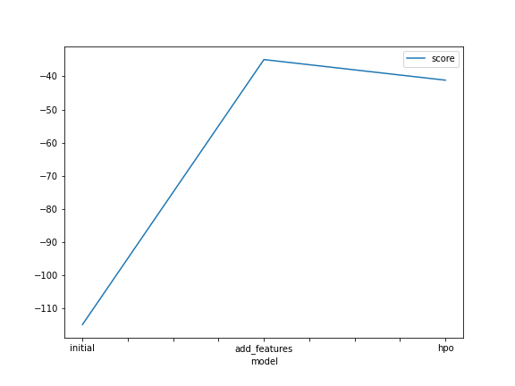

# Report: Predict Bike Sharing Demand with AutoGluon Solution
#### Tesnim Hadhri

## Initial Training
### What did you realize when you tried to submit your predictions? What changes were needed to the output of the predictor to submit your results?
Count value should always be positive as count value represent how many bikes were used. Kaggle will not accept negative values for submission, for this reason we have to set all negative values to zero.

### What was the top ranked model that performed?
The top ranked model taht performed was WeightedEnsemble_L3.

## Exploratory data analysis and feature creation
### What did the exploratory analysis find and how did you add additional features?
Using the EDA, we were able to observe what features are correlated according to 
the frequency of features in the dataset of a specific features in the dataset. We can this way determine if the dataset is equilibred (having different months, different times in a day, different weather conditions)
also introducing  additional features, such as separate month , dat and time alone, may give the model more flexibility to estimate based on the correlation of different features. for instence, months and season are two correlated feature, as the season is specified by a set of months, so separating the month from datetime may give the model flexibilty in learning and thus during inference. 

### How much better did your model preform after adding additional features and why do you think that is?
The initial score was 1.39605, the score after including the features is: `0.54523`
incuding new feature gave the model more flexibility in learning and infrence.

## Hyper parameter tuning
### How much better did your model preform after trying different hyper parameters?
The score after including the features was: 0.54523
The score after hyperparameters tuning is:  0.51992

### If you were given more time with this dataset, where do you think you would spend more time?
If I were given more time with the dataset I will first try to have a closer look at the features and add more features to see their influence on the model training.
 the second thing would be to try optimizing more hyperparameters.

### Create a table with the models you ran, the hyperparameters modified, and the kaggle score.
|model|time|num_stack_levels|excluded_model_types|score|
|initial|600|3|None|1.39605|
|add_features|600|3|None|0.54523|
|hpo|1200|3|NN|0.51992|

### Create a line plot showing the top model score for the three (or more) training runs during the project.

TODO: Replace the image below with your own.

### Create a line plot showing the top kaggle score for the three (or more) prediction submissions during the project.

TODO: Replace the image below with your own.

## Summary
good performance is not only guaranteed by training the model.
understanding your data and your features and how they correlate is a key component to good performance.
Hyperparameter tuning can also bring a big win to your prediction if you know how to tune them.
